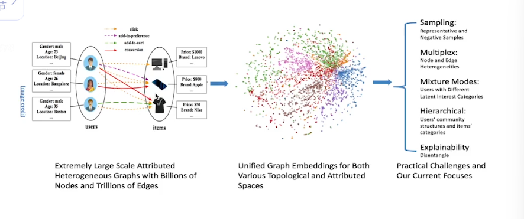

深蓝学院 图深度学习

2022年11月~

# 第一章 课程简介

## 为什么要关注图深度学习

许多数据可以表示为图的形式

许多数据可以转换为图的形式

可能在转换过程中会有一些损失，但在一些任务场景下，基本不会对下游任务产生影响

现实世界中的任务也可以转化为图上的任务，这样就可以用基于图的方法解决现实中的问题。几个经典的图上的学习任务：

（1）链接预测link prediction：给$t$时刻的图，判断在$t+\Delta{t}$时刻某些节点间会不会有链接

（2）节点分类node classification

（3）图分类graph classification：基于graph-level，给定一系列图和标签，再判断新图的标签

图上的机器学习

图上的数据往往不是独立同分布的数据，过去的idd机器学习算法不能直接应用到图上。

如何把图上的任务转化为传统的机器学习问题——如何把图转换了传统数据——图上的表征学习

深度学习在处理图像和文本上都有着非常出色的表现，这些深度学习算法是否可以直接应用到图深度学习上呢？答案是否定的

图深度学习的挑战：

1. 节点的邻居可以是任意数量
2. 拓扑结构更为复杂
3. 节点没有固定的顺序

已经比较成功的用图深度学习的方法来解决现实问题的案例，以体现图深度学习的应用价值和社会意义：

1. 推荐系统

   天然地具有图结构，用户和商品发生交互，构造user-item二部图

   

   

2. 交通预测

   流量预测、路线规划、城市规划、自动驾驶等等等

   路段作为节点，路段之间的关系作为边

3. 药物发现

   药物的开发过程昂贵。分子可以看做图，分子中的一些结构可能具有特殊性质，通过图表征学习，让模型去识别哪些分子中有这样的结构，帮助从海量的分子中筛选，从而减少临床实验的成本。

   

## 图上的特征的学习历史

将图上的数据经过图上的特征学习转换成传统数据，从而就可以用传统的机器学习方法来处理图上的任务

图特征提取方法：

1. 特征工程

   局限性：需要手动提取，费时费力，很难考虑到下游任务的特殊要求

   

2. 特征学习

   可以考虑到下游任务的特性，学到的特征对下游任务是最优的

   

   （1）特征选择：从所有特征中选择若干个最主要的特征出来，实现了降维，保留了原来特征的物理特性和可解释性。

   这个方法的局限在于只能在原有特征空间中做筛选，不能重新组合获得新的特征。

   

   （2）表示学习：通过数据的融合学习一组新的特征，这些特征可能缺少物理意义，但表达能力更强、更有利于下游任务的学习。

   

图的表示学习：

1. 数据降维：把数据表示成图，对图上的每个节点学习一个更低维的表示向量

   

2. 网络嵌入

   图嵌入起源于词嵌入

   

3. 图深度学习

## 本课程将关注哪些内容？

1. 理论学习

   

2. 图嵌入

   第二代图嵌入方法

   

3. 图神经网络

   

   图滤波操作：通过图滤波希望对节点表示进行增强，不改变拓扑结构

   

   图池化操作：通过图池化操作将图不断变小

   

4. 图神经网络的鲁棒性和可扩展性

   预测1-6是合法用户，7-8是不合法用户，8为了迷惑模型，和3进行一笔交易，就迷惑了模型，模型将8判断为合法。

   对图结构进行微小扰动，预测结果不应该发生变化，但实际上图神经网络往往是比较脆弱的，我们希望图神经网络有比较高的鲁棒性。

   

   

5. 其他图上的深度学习模型

   

   

6. 图深度学习的应用（上）

   （1）自然语言：

   

   

   

   （2）数据挖掘：

   

   （3）推荐系统：

   

7. 图深度学习的应用（下）

   （1）计算机视觉：

   

   （2）健康医疗：

   

8. 图深度学习的研究前沿

   （1）可表达性：

   我们通过图深度学习得到了图的表示之后，这个表示究竟有多强大？可以在特定任务目标上研究可表达性。

   

   （2）更深的图神经网络

   随着图神经网络深度增加，表达能力反而减弱——过平滑问题

   

   （3）图上的自监督学习

   

   （4）可解释性

   样本级的可解释性：给定一个样本，模型是如何对这个样本进行解释的

   模型级的可解释性

   

   （5）一些新的应用：

   

## 课程形式和安排

