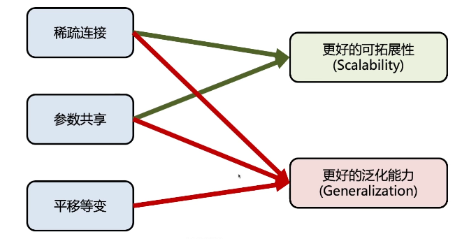

# 第三章 深度学习基础

## 深度学习简史

深度学习、机器学习、人工智能之间的关系：

几个突破性的研究的时间轴：

深度模型训练需要两个条件：

1. 海量的数据

2. 强大的算力

## 前馈神经网络

人工神经元：

如果没有激活函数$\alpha$，再多层神经元堆叠也都是线性的，激活函数让线性变为非线性：

输出层和损失函数的选择：与具体任务有关

1. 回归任务：让神经网络输出值尽可能逼近真实值

   

2. 分类任务：输出层用softmax函数，将输出转化为概率

   

## 神经网络的训练

以回归任务为例，训练的目标是最小化损失函数

使用最广泛的训练方法：**梯度下降法**

梯度（gradient）：**标注了函数上升最快的方向，**因为想最小化损失函数，因此要往与梯度相反的方向走。图中$\eta$是移动的步长。

如何有效计算神经元的梯度？反向传播，链式法则求导

（这里讲的非常少，但是比较基础，有空或许自己补充一点点

## 卷积神经网络

应用最多的场景是：图像领域

Input的三层：输入有3个channel

**卷积操作：**

1. **稀疏连接：**看起来和全连接操作很像，但是有稀疏连接的特性，比如$s_2$只和$x_1、x_2、x_3$这几个相邻的有关，因此参数量会少很多

2. **参数共享：**参数共享进一步减少了参数数量。也可以使用多个卷积核。

   

3. **平移不变性：**

   不管下面这个兔子在图的哪个位置，得到的输出的信息是一样的、但可能位置不一样。有助于提高泛化能力，表达能力更强（相同的信息在不同位置可以捕捉到）

   

卷积操作的总结：

**池化操作：**提高感受野，每一个输出对应的输出的区域可以更大。

## 循环神经网络

处理序列数据，比如文本信息、声音数据、DNA数据、时序数据（股票走势）等等等

序列数据上的任务：输入是序列数据。输出可能是序列数据，比如机器翻译；也可能是一个分类，比如语义分析。

有一个问题：如何处理序列长短不一的问题？不管有多长就重复计算就行

从图中看$W_{hh}$和$W_{yh}$是共享的参数，同一信息出现在序列不同位置可以捕捉到相同信息。

在训练过程中的梯度消失与梯度爆炸问题：

如果某个元素是小于1的，一堆小于1的元素连续相乘就逼近0，也就是说$L(W)$对靠前的层的影响非常小，梯度消失，无法捕捉长序列的依赖性

如果某个元素是大于1的，一堆大于1的元素连续相乘就会非常大，导致很难训练

Long Short Term Memory（LSTM）：

LSTM单元如下：比普通RNN多了一个单元状态$C^{(t)}$

圈圈里的代表元素级别（pointwise operation）的操作

感觉这里老师讲的不是很清楚

有一个讲的比较清楚的博客记录一下：https://zhuanlan.zhihu.com/p/42717426

## 自编码器

编码器的目标是：编码输入的信息

解码器的目标是：重构输入的信息

目标是$h$能很好地编码输入的信息

我们不希望$h$和$x$完全一样，希望它过滤掉一些信息，会存在“信息瓶颈”，对$h$做出限制，比如维度远远小于输入